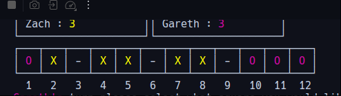

# Results of Testing

The test results show the actual outcome of the testing, following the [Test Plan](test-plan.md)

---

## Chain at end of board

Forming a chain of 3 in the last 3 boxes of play board.

### Test Data Used

Details of test data. Details of test data. Details of test data. Details of test data. Details of test data. Details of
test data. Details of test data.

### Test Result

The chain failed to break

---

## Example Test Name

Example test description. Example test description.Example test description. Example test description.Example test
description. Example test description.

### Test Data Used

Details of test data. Details of test data. Details of test data. Details of test data. Details of test data. Details of
test data. Details of test data.

### Test Result

Comment on test result. Comment on test result. Comment on test result. Comment on test result. Comment on test result.
Comment on test result.

---

