# Results of Testing

The test results show the actual outcome of the testing, following the [Test Plan](test-plan.md)

---

## Input: Main menu (play game) - Valid

I will attempt to play the game from the main menu

### Test Data To Use

I will input the character **'p'**

### Test Result

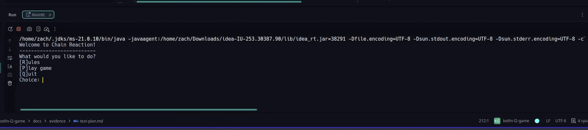

The test passed - the **'p'** value was accepted to start the game

---

## Input: Main menu (rules) - Valid

I will attempt to show the rules from the main menu

### Test Data Used

I will input the character **'r'**

### Test Result

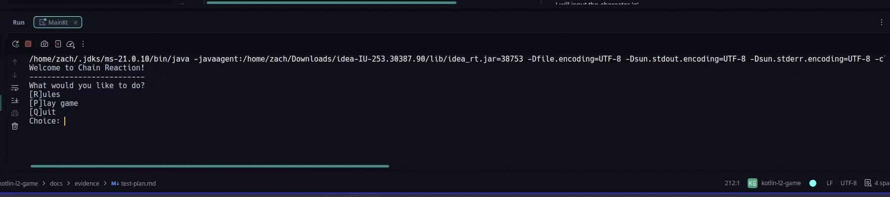

The test passed - the **'r'** value was accepted and showed the rules

---

## Input: Main menu (quit) - Valid

I will attempt to quit the game from the main menu

### Test Data Used

I will input the character **'q'**

### Test Result

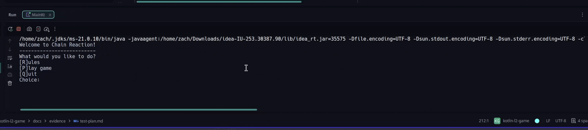

The test passed - the **'q'** value was accepted and the game quit

---

## Input: Main menu - Invalid

I will attempt to input several invalid inputs to the main menu

### Test Data Used

I will input the values **'l'**, **'ghr'** as well as **blank**

### Test Result

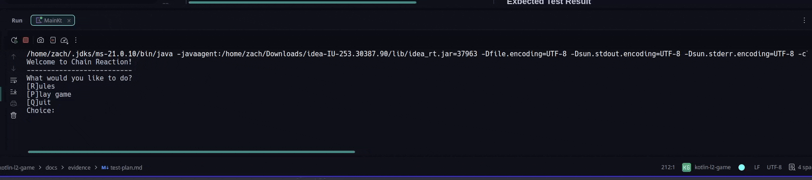

The test passed - the values **"l"**, **'ghr'** and **blank** were successfully rejected

---

## Input: Main menu (play game) when characters after first - Valid

I will attempt to play the game with more characters after the initial

### Test Data Used

I will input the string **"pfdg"**

### Test Result

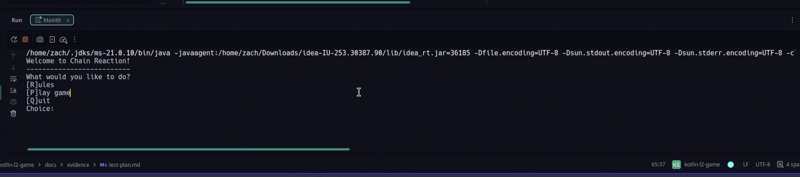

The test passed - the value **"pfdg"** was accepted based of the first character and the game started

---

## Input: Main menu (play game) using uppercase char - Valid

I will attempt to play the game using an uppercase character to start the game

### Test Data Used

I will input the character **'P'**

### Test Result

The test passed - the value **'P'** was accepted and the game started

---

## Input: Player names - Valid

I will test that a valid player name can be entered and accepted

### Test Data Used

I will try to enter a valid player names **"Dave"** and **"Bob"** for player 1 and 2

### Test Result

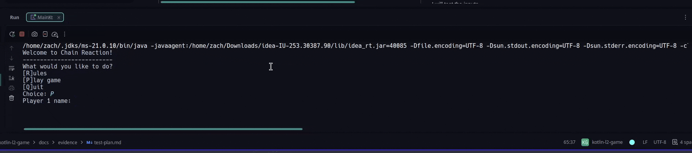

The test passed - the values **"Dave"** and **"Bob"** were accepted

---

## Input: Player names - Boundary

I will test when the player name is the maximum characters (14) as well as the minimum (1)

### Test Data Used

I will test the inputs

- **"a"** (player 1)
- **"Alexanderjames"** (player 2)

### Test Result

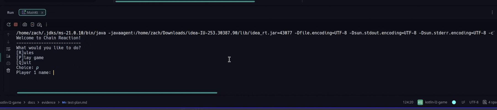

The test passed - the values **"a"** and **"Alexanderjames"** were accepted

---

## Input: Player names - Invalid

I will test invalid player names (when blank and too long)

### Test Data Used

I will test the inputs

- **" "**
- **"JefferyJefferson"**

### Test Result

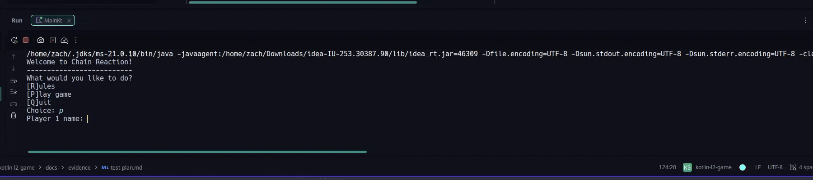

The test passed - The player names were successfully rejected and the player is given information on why their name was
rejected

---

## Input: Player counter selection - Valid

I will test placing player tokens in valid locations

### Test Data Used

I will test the inputs

- **'2'**
- **'10'**
- **'7'**

### Test Result

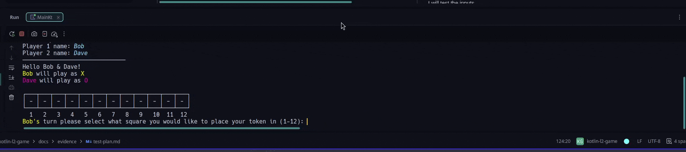

The test passed - The counter inputs were accepted (values **'2'**, **'10'** and **'7'**)

---

## Input: Player counter selection - Boundary

I will test placing player tokens in boundary locations (**'1'** and **"12"**)

### Test Data Used

I will test the inputs

- **'1'**
- **"12"**

### Test Result

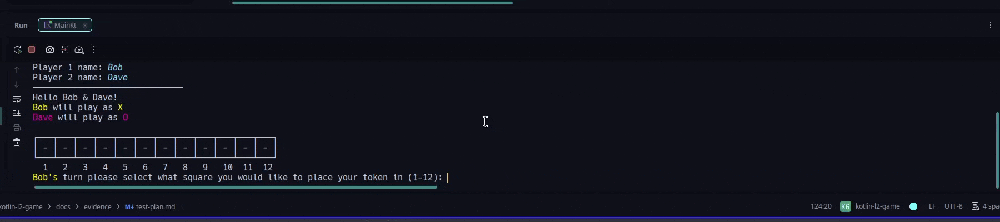

The test passed - The counter inputs were accepted (values **'1'** and **"12"**)

---

## Input: Player counter selection - Invalid

I will test invalid inputs for player counter selection

### Test Data Used

I will test the inputs:

- **"0"**
- **"-5"**
- **"13"**
- **"784"**
- **" "**
- **"Dave"**

### Test Result

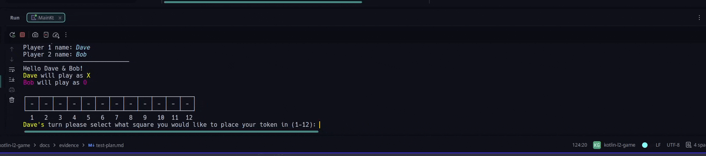

The test passed - the values were rejected successfully and the player was informed on why their inputs were invalid

---

## Gameplay: Placing a token

I will attempt to place a token in valid locations.

### Test Data Used

I will test the inputs

- **'2'**
- **'10'**
- **'7'**

### Test Result

The test passed - the player's tokens successfully enter the boxes (at location **2**, **10** and **7**).

---

## Gameplay: Placing a token - Boundary

I will attempt to place tokens at boundary locations

### Test Data Used

I will test the inputs

- **'1'**
- **"12"**

### Test Result

The test passed - the player's tokens successfully enter the boxes (at location **1**, **12** and **7**).

---

## Gameplay: Forming a chain of 3 - Boundary

I will test forming a chain of 3

### Test Data Used

I will play Bob's tokens in slot **4**, **5** and **6**

### Test Result

The test passed - A chain of 3 was formed (the players pieced were removed from the board)

---

## Gameplay: Forming a chain of 4

I will test forming a chain of 4

### Test Data Used

I will play Bob's tokens in slot **4**, **5**, **7** and **6**

### Test Result

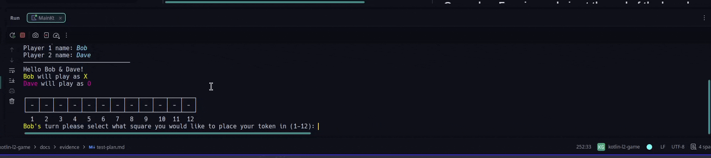

The test passed - a chain of 4 was successfully formed (the players pieced were removed from the board)

---

## Gameplay: Forming a chain at the start of the board - Boundary

I will form a chain at the start of the board

### Test Data Used

I will play Bob's tokens in slot **1**, **2** and **3**

### Test Result

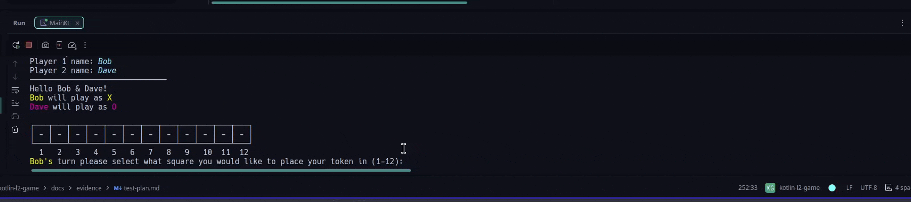

The test passed - a chain was successfully formed (the players pieces were removed from the board)

---

## Gameplay: Forming a chain at the end of the board - Boundary

I will form a chain at the end of the board

### Test Data Used

I will play Bob's tokens in slot **10**, **11**, **12**

### Test Result

The test passed - a chain was successfully formed (the players pieces were removed from the board)

---

## Gameplay: The board forming

When the game starts the board should form

### Test Data Used

Play from the main menu (entering the second players name to start the game "Dave")

### Test Result

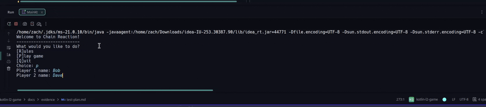

The test passed - the board successfully formed

---

## Gameplay: Player gaining score

I will form a chain with Bob's counters and they should gain points

### Test Data Used

I will form a chain in position **4**, **5** and **6**

### Test Result

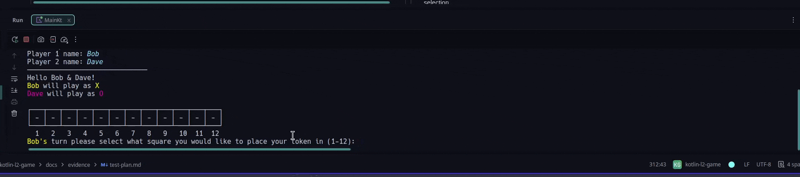

The test passed - Bob successfully gained 3 points

---

## Gameplay: Player winning with exactly 10 points - Boundary

Testing player winning (reaching 10 points)

### Test Data Used

I will test when bob reaches 10 points

### Test Result

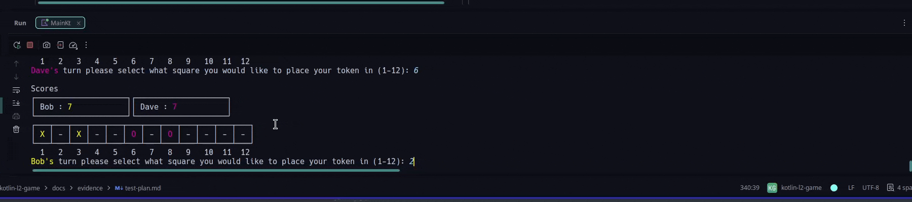

The test passed - Bob successfully won upon reaching 10 points

---

## Gameplay: Player winning with >10 points - Valid

I will test player winning (reaching 10 points)

### Test Data Used

I will test when bob reaches 11 points

### Test Result

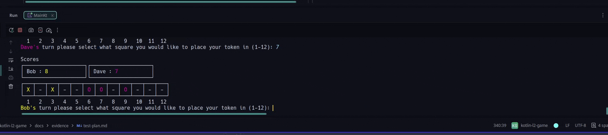

The test passed - Bob successfully won upon reaching 11 points

---

## Gameplay: Player pushing another players token out

I will test pushing another players token out by using 2 adjacent tokens of the other player

### Test Data Used

I will have Dave's token in position **4** and Bob's tokens in position **3** and **5**

### Test Result

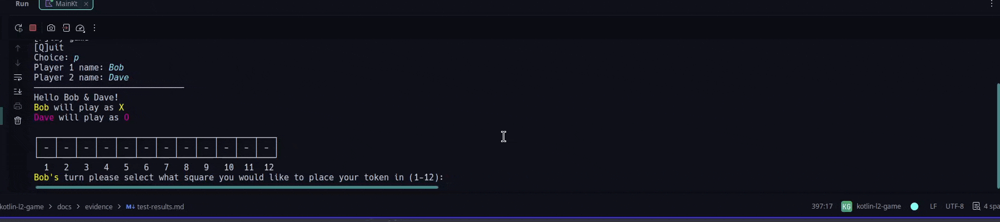

The test passed - Dave's token was successfully pushed out

---

## Input: Placing a token between 2 of the other player's - Invalid

I will test placing a token in an invalid place due to being blocked by the other players

### Test Data Used

I will attempt to put Dave's token in slot **5** when Bob's tokens are in **4** and **6**

### Test Result

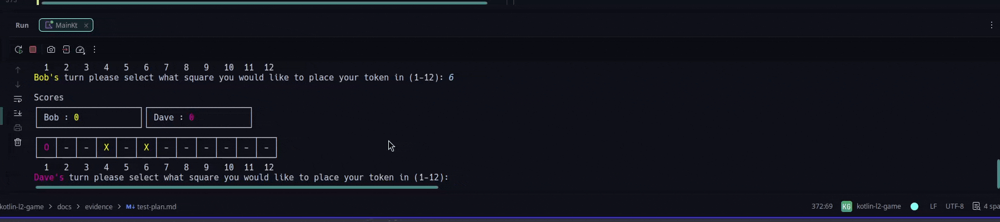

The test passed - Dave was unable to play a token in the invalid location and was informed as to why

---